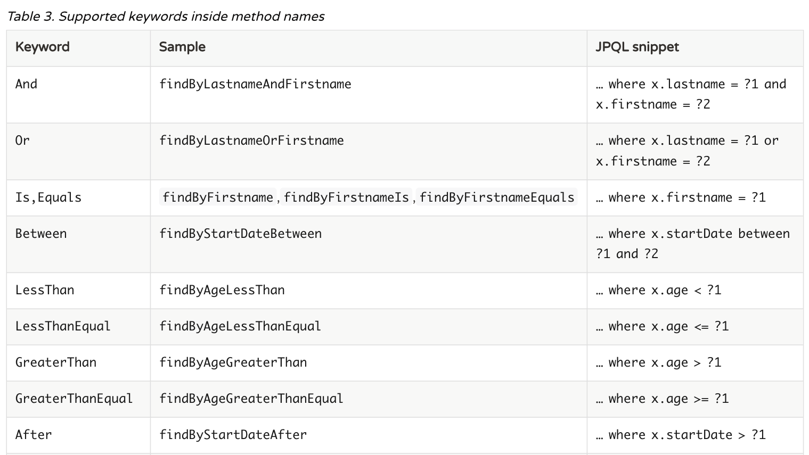
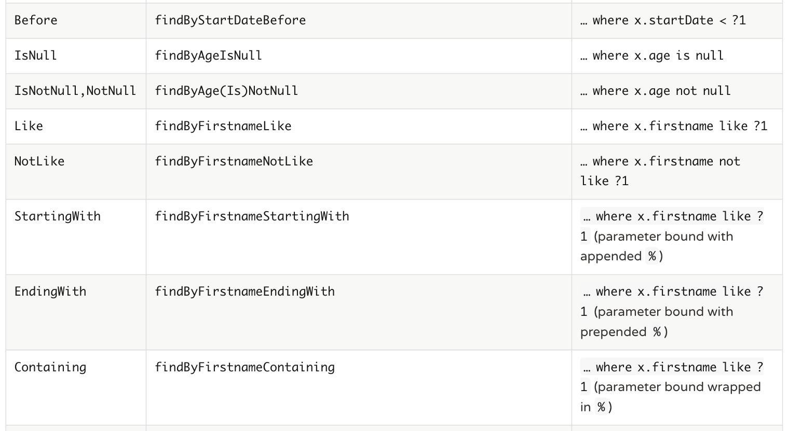
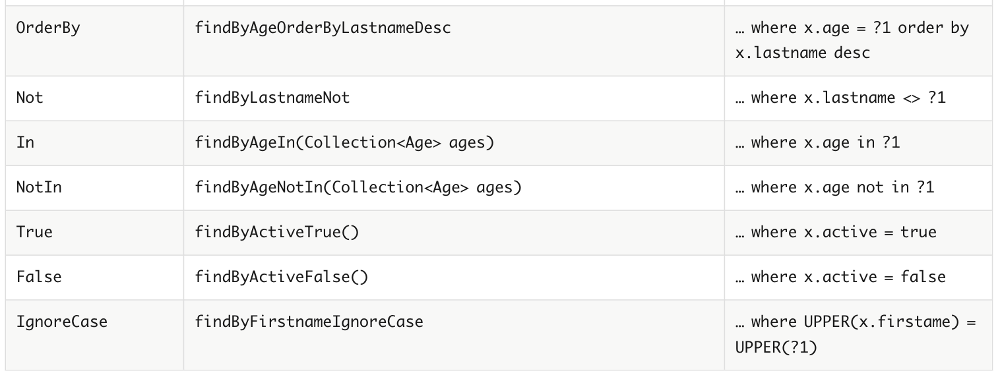

# JPA QueryMethod

## 이론

* 네이밍 컨벤션에 따라 인터페이스에 메소드를 선언하면, 해당 쿼리를 자동으로 생성해줌





## 실전코드

```java
public interface PersonRepository extends JpaRepository<Person, Long> {
    List<Person> findByName(String name);

    List<Person> findByBlockIsNull();

    List<Person> findByBloodType(String bloodType);

    List<Person> findByBirthdayBetween(LocalDate startDate, LocalDate endDate);
}
```

```java
@Service
@Slf4j
public class PersonService {
    @Autowired
    private PersonRepository personRepository;

    public List<Person> getPeopleExcludeBlocks() {
        return personRepository.findByBlockIsNull();
    }

    public List<Person> getPeopleByName(String name) {
        return personRepository.findByName(name);
    }

    @Transactional(readOnly = true)
    public Person getPerson(Long id) {
        Person person = personRepository.findById(id).get();

        log.info("person : {}", person);

        return person;
    }
}
```

```java
@SpringBootTest
class PersonRepositoryTest {
    @Autowired
    private PersonRepository personRepository;

    @Test
    void crud() {
        Person person = new Person();
        person.setName("martin");
        person.setAge(10);
        person.setBloodType("A");

        personRepository.save(person);

        System.out.println(personRepository.findAll());

        List<Person> people = personRepository.findAll();

        assertThat(people.size()).isEqualTo(1);
        assertThat(people.get(0).getName()).isEqualTo("martin");
        assertThat(people.get(0).getAge()).isEqualTo(10);
        assertThat(people.get(0).getBloodType()).isEqualTo("A");
    }

    @Test
    void hashCodeAndEquals() {
        Person person1 = new Person("martin", 10, "A");
        Person person2 = new Person("martin", 10, "A");

        System.out.println(person1.equals(person2));
        System.out.println(person1.hashCode());
        System.out.println(person2.hashCode());

        Map<Person, Integer> map = new HashMap<>();
        map.put(person1, person1.getAge());

        System.out.println(map);
        System.out.println(map.get(person2));
    }

    @Test
    void findByBloodType() {
        givenPerson("martin", 10, "A");
        givenPerson("david", 9, "B");
        givenPerson("dennis", 8, "O");
        givenPerson("sophia", 7, "AB");
        givenPerson("benny", 6, "A");
        givenPerson("john", 5, "A");

        List<Person> result = personRepository.findByBloodType("A");

        result.forEach(System.out::println);
    }

    @Test
    void findByBirthdayBetween() {
        givenPerson("martin", 10, "A", LocalDate.of(1991, 8, 15));
        givenPerson("david", 9, "B", LocalDate.of(1992, 7, 10));
        givenPerson("dennis", 8, "O", LocalDate.of(1993, 1, 5));
        givenPerson("sophia", 7, "AB", LocalDate.of(1994, 6, 30));
        givenPerson("benny", 6, "A", LocalDate.of(1995, 8, 30));

        List<Person> result = personRepository.findByBirthdayBetween(LocalDate.of(1991, 8, 1), LocalDate.of(1995, 8, 31));

        result.forEach(System.out::println);
    }

    private void givenPerson(String name, int age, String bloodType) {
        givenPerson(name, age, bloodType, null);
    }

    private void givenPerson(String name, int age, String bloodType, LocalDate birthday) {
        Person person = new Person(name, age, bloodType);
        person.setBirthday(birthday);

        personRepository.save(person);
    }
}
```

```java
@SpringBootTest
class PersonServiceTest {
    @Autowired
    private PersonService personService;
    @Autowired
    private PersonRepository personRepository;
    @Autowired
    private BlockRepository blockRepository;

    @Test
    void getPeopleExcludeBlocks() {
        givenPeople();

        List<Person> result = personService.getPeopleExcludeBlocks();

        result.forEach(System.out::println);
    }

    @Test
    void getPeopleByName() {
        givenPeople();

        List<Person> result = personService.getPeopleByName("martin");

        result.forEach(System.out::println);
    }

    @Test
    void cascadeTest() {
        givenPeople();

        List<Person> result = personRepository.findAll();
        result.forEach(System.out::println);

        Person person = result.get(3);
        person.getBlock().setStartDate(LocalDate.now());
        person.getBlock().setEndDate(LocalDate.now());

        personRepository.save(person);
        personRepository.findAll().forEach(System.out::println);

//        personRepository.delete(person);
//        personRepository.findAll().forEach(System.out::println);
//        blockRepository.findAll().forEach(System.out::println);

        person.setBlock(null);
        personRepository.save(person);
        personRepository.findAll().forEach(System.out::println);
        blockRepository.findAll().forEach(System.out::println);
    }

    @Test
    void getPerson() {
        givenPeople();

        Person person = personService.getPerson(3L);

        System.out.println(person);
    }

    private void givenPeople() {
        givenPerson("martin", 10, "A");
        givenPerson("david", 9, "B");
        givenBlockPerson("dennis",7,"O");
        givenBlockPerson("martin", 11, "AB");
    }

    private void givenPerson(String name, int age, String bloodType) {
        personRepository.save(new Person(name, age, bloodType));
    }

    private void givenBlockPerson(String name, int age, String bloodType) {
        Person blockPerson = new Person(name, age, bloodType);
        blockPerson.setBlock(new Block(name));

        personRepository.save(blockPerson);
    }
}
```
